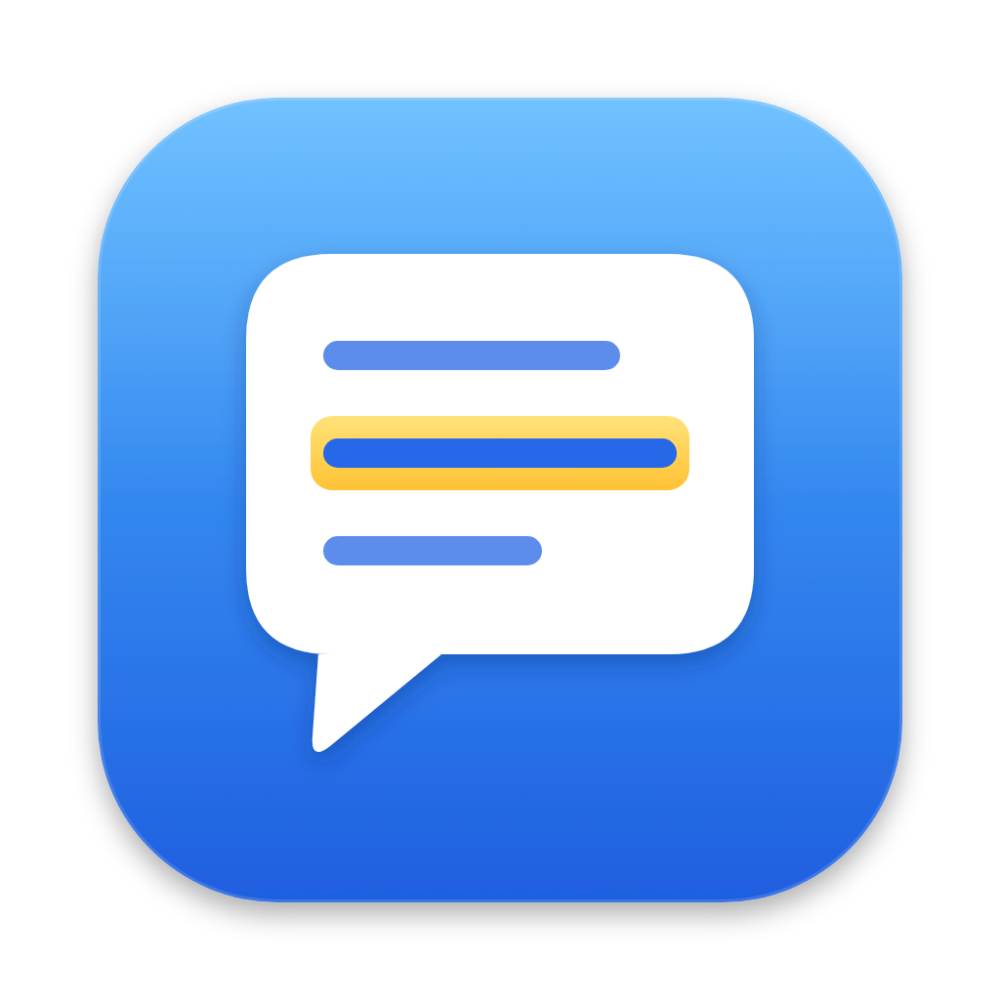
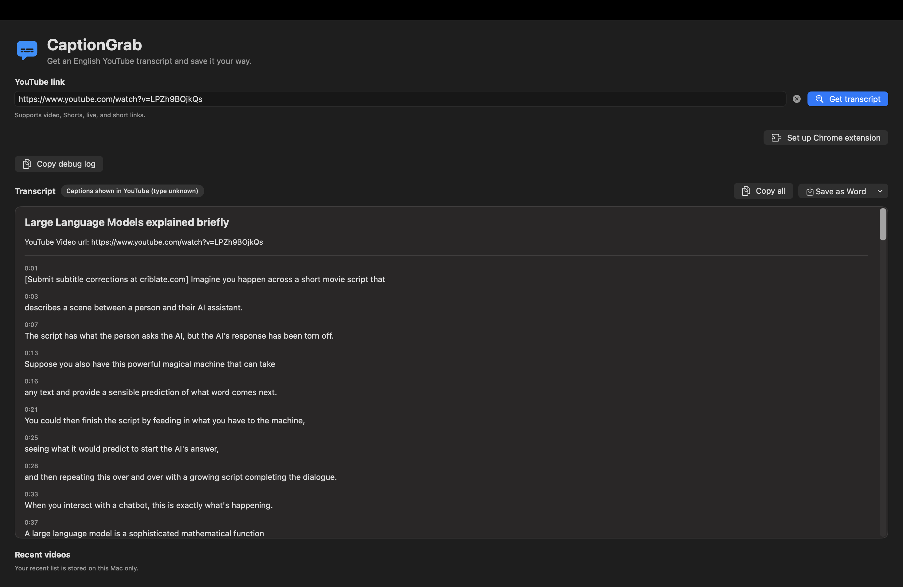

<p align="center">
  
</p>

<h1 align="center">CaptionGrab</h1>

<p align="center">Fetch YouTube captions and save them as Markdown or Word.</p>

<p align="center"><a href="https://github.com/9phfr6dsw4-dotcom/captiongrab/releases/latest"><strong>Download the latest release</strong></a></p>

<p align="center">
  <a href="https://github.com/9phfr6dsw4-dotcom/captiongrab/releases/latest"></a>
  
  <a href="https://github.com/9phfr6dsw4-dotcom/captiongrab/blob/main/LICENSE"></a>
  <a href="https://github.com/9phfr6dsw4-dotcom/captiongrab/actions/workflows/macos-ci.yml"></a>
</p>

<p align="center"></p>

## Features

- Paste or drop a YouTube link. Direct retrieval looks for English captions, preferring creator-made captions and then auto-generated English captions when available.
- See the caption type when known, then copy the transcript or export it as Markdown or Word (`.docx`). Directly retrieved caption cue order and explicit line breaks are preserved.
- If direct retrieval is blocked, the optional Chrome companion can capture the transcript shown in YouTube's panel on the matching video page. Its language or track type may be unknown, and the extension does not request cookie access.
- If CaptionGrab cannot parse an unfamiliar transcript layout, Apple Foundation Models can try on-device recovery. The output is checked against visible text and timestamps and marked for review, but it may omit captions or group lines incorrectly.
- Clear or replace a link without losing the current transcript or recent-video list.
- Keep a recent-video list on your Mac and clear it whenever you like.

## Install

1. Download `CaptionGrab.zip` from the latest release and unzip it.
2. In Finder, drag **CaptionGrab.app** into **Applications**.
3. Open CaptionGrab from **Applications**.

<details><summary>First launch on macOS</summary>

The release is ad-hoc signed and not notarized. If macOS blocks the first launch, open **System Settings → Privacy & Security**, choose **Open Anyway** for CaptionGrab, confirm, then reopen CaptionGrab from Applications. CaptionGrab requests no macOS privacy permissions.

</details>

The optional Chrome companion needs a separate extension setup:

<details>
<summary>Set up the optional Chrome companion</summary>

1. Open CaptionGrab from Applications and choose **Set up Chrome extension**.
2. In Chrome, open `chrome://extensions`, enable **Developer mode**, choose **Load unpacked**, and select the `ChromeExtension` folder revealed by CaptionGrab.
3. If Chrome still points to an older or temporary folder, remove that stale entry and load the folder from the installed app.

Keep CaptionGrab in Applications after setup. If you move it, run setup again to refresh the Native Messaging helper path.
After installing CaptionGrab 1.2.17, open `chrome://extensions` and click **Reload** on the CaptionGrab companion so Chrome loads extension version 1.2.13 from the updated app bundle.
If automatic panel opening fails, use **Copy debug log** to capture a privacy-safe trace; caption text is not included.

</details>

## Privacy

CaptionGrab contacts YouTube for video information and captions. It uses no account, API key, paid service, analytics, or third-party transcription service. The optional Apple Foundation Models fallback runs only on this Mac, only when Apple Intelligence is available, and only after the deterministic transcript readers fail. The visible transcript text is passed from Chrome to CaptionGrab through local Native Messaging; it is not sent to a remote AI service. Recovered cues are checked against the visible text and timestamps and labeled for review, but recovery may omit captions or group lines incorrectly. Recent-video history and preferences stay on your Mac; exports go only to the location you choose.

> CaptionGrab is an unofficial tool and is not affiliated with or endorsed by YouTube or Google. YouTube may change the web-player behavior the app relies on.

<details>
<summary>Build and test</summary>

Requires Xcode and macOS 26 or later.

```sh
swift test
bash Scripts/package-app.sh
```

</details>
